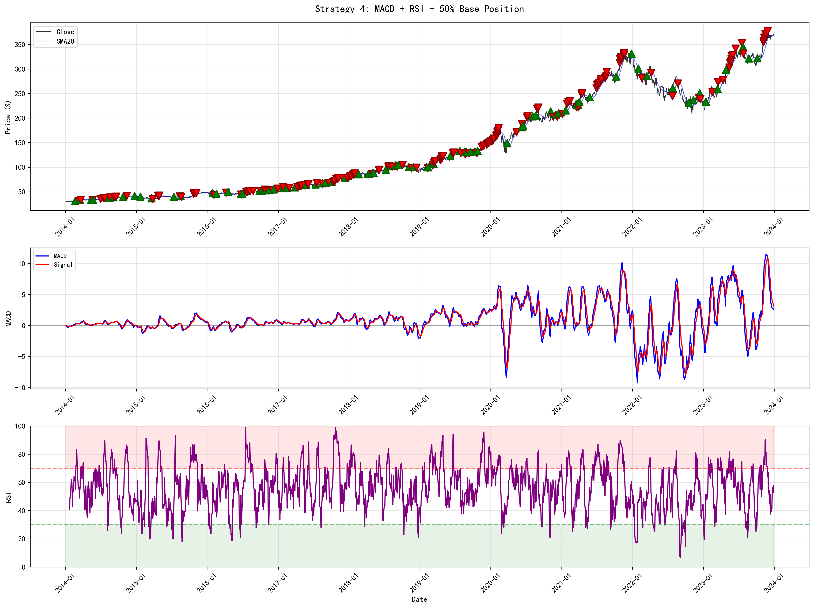

# msft-tech
# MSFT Technical Analysis & Trading Strategies Backtest

A comprehensive quantitative analysis project that implements and backtests four systematic trading strategies for Microsoft Corporation (MSFT) stock over a 10-year period (2014-2024).

## 📊 Project Overview

This project performs an in-depth technical analysis of MSFT stock using Python and implements four distinct algorithmic trading strategies:

1. **Strategy 1**: 10/30 Simple Moving Average (SMA) Crossover
2. **Strategy 2**: 20/50 SMA with 200-period Trend Filter
3. **Strategy 3**: MACD + RSI Combined Indicators
4. **Strategy 4**: MACD + RSI with 50% Base Position (⭐ **Best Performer**)

## 🎯 Key Results

| Strategy | Total Return | CAGR | Max Drawdown | Sharpe Ratio | Win Rate |
|----------|--------------|------|--------------|--------------|----------|
| Strategy 1: 10/30 SMA | 25.69% | 2.31% | 35.95% | 0.96 | 94.44% |
| Strategy 2: 20/50 SMA + 200 Filter | 26.33% | 2.36% | 33.10% | 0.90 | 81.82% |
| Strategy 3: MACD+RSI | 66.80% | 5.25% | 35.19% | 0.60 | 49.38% |
| **Strategy 4: MACD+RSI + 50% Base** | **356.69%** | **16.40%** | **29.48%** | **0.95** | 6.10% |

**Strategy 4** achieved exceptional risk-adjusted returns with:
- 🚀 **356.69%** total return (turning $100k into $456k)
- 📈 **16.40%** annualized return (CAGR)
- 🛡️ **29.48%** maximum drawdown (lowest among all strategies)
- ⚖️ **0.95** Sharpe ratio (best risk-adjusted performance)

## 🔧 Technologies & Dependencies

### Required Python Packages:
```bash
yfinance       # Yahoo Finance data download
ta             # Technical analysis indicators
backtrader     # Backtesting framework
pandas         # Data manipulation
numpy          # Numerical computing
matplotlib     # Visualization
```

### Installation:
```bash
pip install yfinance ta backtrader pandas numpy matplotlib
```

## 📁 Project Structure

```
msft-tech/
├── Technical_Analysis.ipynb          # Main analysis notebook (主代码文件)
├── AI_Investment_Report.txt          # Detailed investment analysis report
├── strategy_performance_report.json  # Performance metrics in JSON format
├── all_trades_details.csv           # Complete trade history
├── msft_strategy1.png               # Strategy 1 performance chart
├── msft_strategy2.png               # Strategy 2 performance chart
├── msft_strategy3_macd_rsi.png      # Strategy 3 performance chart
├── msft_strategy4_macd_rsi_50pct_target.png  # Strategy 4 performance chart
└── README.md                        # This file
```

## 🚀 Usage

1. **Clone the repository:**
   ```bash
   git clone https://github.com/hongchenxi44-alt/msft-tech.git
   cd msft-tech
   ```

2. **Install dependencies:**
   ```bash
   pip install yfinance ta backtrader pandas numpy matplotlib
   ```

3. **Open and run the Jupyter notebook:**
   ```bash
   jupyter notebook Technical_Analysis.ipynb
   ```

4. **Execute all cells** to:
   - Download MSFT historical data (2014-2024)
   - Calculate technical indicators
   - Run backtests for all four strategies
   - Generate performance visualizations
   - Export analysis reports

## 📈 Strategy Details

### Strategy 1: 10/30 SMA Crossover
- **Logic**: Buy when 10-day SMA crosses above 30-day SMA, sell on reverse
- **Result**: Low returns (25.69%), high win rate but failed to capture MSFT's uptrend

### Strategy 2: 20/50 SMA + 200 Trend Filter
- **Logic**: SMA crossover with long-term trend filter for risk management
- **Result**: Slightly better drawdown control but limited upside participation

### Strategy 3: MACD + RSI
- **Logic**: Multi-indicator momentum/mean-reversion approach
- **Result**: Better absolute returns (66.80%) but volatile with poor risk efficiency

### Strategy 4: MACD + RSI + 50% Base Position ⭐
- **Logic**: Maintains permanent 50% long position + active 50% traded via MACD/RSI
- **Result**: **Outstanding performance** - combines buy-and-hold beta with tactical alpha
- **Key Insight**: Low win rate (6.1%) but captures large trend-following gains

## 📊 Visualizations

The project generates performance charts for all strategies showing:
- Portfolio value over time
- Entry/exit points
- Drawdown periods
- Comparative performance

<div align="center">
  
  <p><em>Strategy 4: Best performing strategy with 356.69% total return</em></p>
</div>

## 💡 Key Insights

1. **Base Position Advantage**: Strategy 4's permanent 50% allocation was the critical differentiator, capturing underlying equity beta while adding tactical alpha

2. **Win Rate Paradox**: Strategy 4's extremely low win rate (6.1%) demonstrates that traditional metrics can be misleading - it takes frequent small losses but captures few large trending gains

3. **Risk Management**: Strategy 4 achieved the lowest maximum drawdown (29.48%) despite the highest returns, showcasing superior capital preservation

4. **Simple vs Complex**: Simple SMA strategies (1 & 2) significantly underperformed, failing to generate meaningful alpha

## ⚠️ Limitations & Disclaimers

- **Backtest Overfitting**: Strategies may be optimized for historical MSFT data and may not generalize to future markets
- **Transaction Costs**: Analysis does not account for commissions, slippage, or taxes
- **Single Asset Risk**: All strategies concentrate on one stock (MSFT)
- **Data Snooping Bias**: Multiple strategy testing introduces selection bias
- **Not Financial Advice**: This is an educational project for technical analysis learning

## 📚 Learn More

For detailed investment analysis and recommendations, see:
- [AI_Investment_Report.txt](AI_Investment_Report.txt) - Comprehensive performance analysis
- [strategy_performance_report.json](strategy_performance_report.json) - Detailed metrics
- [all_trades_details.csv](all_trades_details.csv) - Complete trade log

## 🤝 Contributing

Contributions, issues, and feature requests are welcome! Feel free to check the issues page.

## 📝 License

This project is open source and available for educational purposes.

## 👤 Author

Created as part of quantitative trading strategy research and backtesting analysis.

---

**Note**: This analysis is for educational and research purposes only. Past performance does not guarantee future results. Always conduct your own research before making investment decisions.
